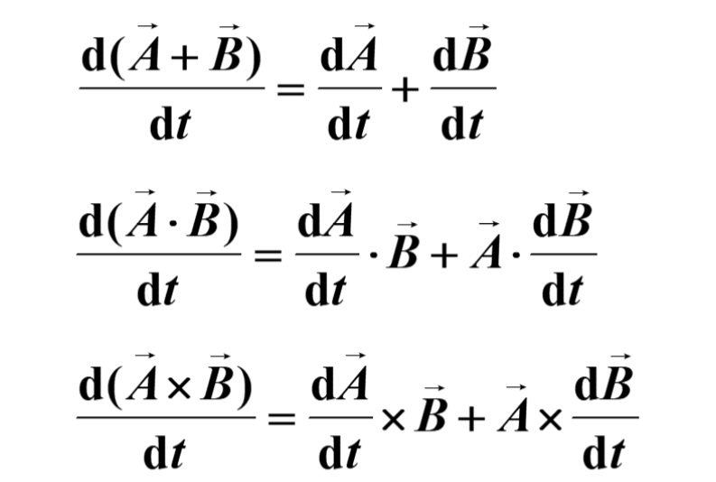

# 大学物理期末复习
- # 力学
  - ## 绪论
    - ## 内容涵盖
      - ## 牛顿力学
        - 宏观尺度弱引力场的物体的低速运动
      - ## 运动学
          - 描述运动而不解释原因
      - ## 动力学
          - 眼睛物体运动与力之间的关系
      - ## 静力学
          - 研究力的平衡问题
      - ## 狭义相对论
        - 高速运动的物体
        - 相对论运动学、动力学
      - ## 振动和波动
  - # 质点运动学
    - ## 矢量
      - ### 矢量微分
        - 
    - ## 质点
    - ## 屏东和转动
    - ## 参考系固结坐标系
      - ### 直角坐标系
        - （x,y,z）
      - ### 平面极坐标系
      - ### 自然坐标系
  - ## 刚体的转动

