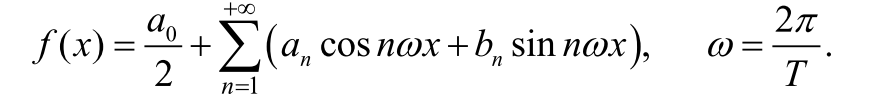
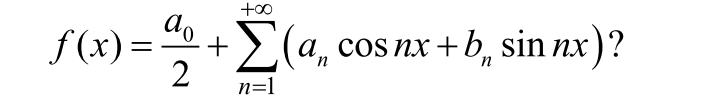
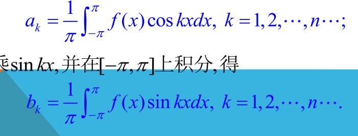

# 傅里叶级数
- ### 任何复杂的周期函数都可以展开为周期相同的正余弦级数
- 
- 若该级数收敛，则原函数以$\frac{2\pi}{\omega}$ 为周期
- # $2\pi$为周期的傅里叶级数
  - 
  - 
  - 通过两边同乘$\sin kx$或者$\cos kx$积分来获得
  - ## 特殊函数的傅里叶级数
    - 奇函数的只有$b_n$（同为奇函数的正弦）
    - 偶函数只有$a_n$
