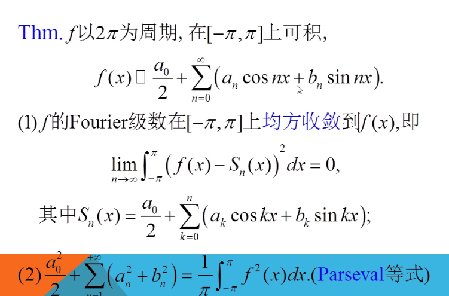

# 傅里叶级数

- ## 傅里叶级数的收敛性
  - ### **狄利克雷判别法**：如果函数分段单调有界，收敛于左右极限的平均值
  - ### **李比希判别法**：如果函数连续可微，如果f(x)连续可微，则收敛于f(x0)
  - 
  - 通过傅里叶级数可以得到一些级数的求和值
- ## 广义傅里叶级数
  - 要求等位于傅里叶级数中sinx,sin2x，cosx等的一组正交基进行类似的傅里叶操作
  - 系数成为广义傅里叶系数
  - 
  - Parseval等式
  - 
  - 