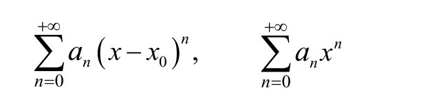
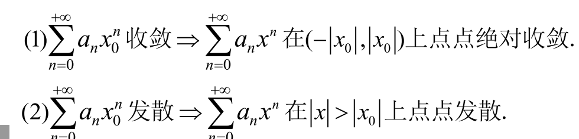
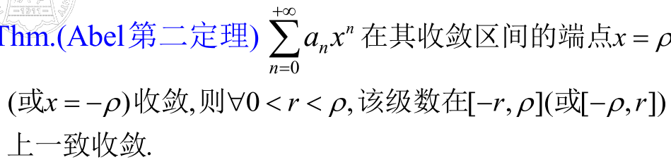
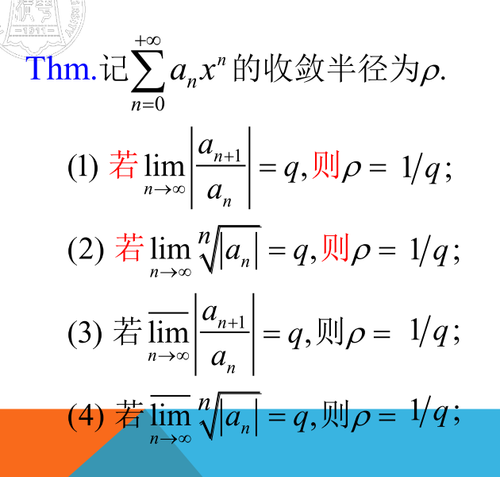

# 幂级数
- # 定义
  - 
- # 幂级数的收敛性
  - ## 阿贝尔第一定理
  - 幂级数在x=r绝对收敛，则在[-r,r]一致收敛
- # 收敛半径
  - 
  - $\rho$是收敛半径
  - ## 阿贝尔第二定理
    - 
  - ## 收敛半径的求法
    - 
- # 幂级数函数和函数的性质
  - 幂级数**逐项积分**和**逐项求导**得到的新的幂级数的**收敛半径与原级数相同**（收敛域的开闭可能发生变化）
- # 函数的幂级数展开
  - ### 把函数无穷次泰勒展开就会得到**泰勒级数**
  - ## 展开前后的相等性
    -  它的任意阶导在某区间内一致有界
  -  ## 展开的唯一性
     -  同泰勒展开的知识点
-  