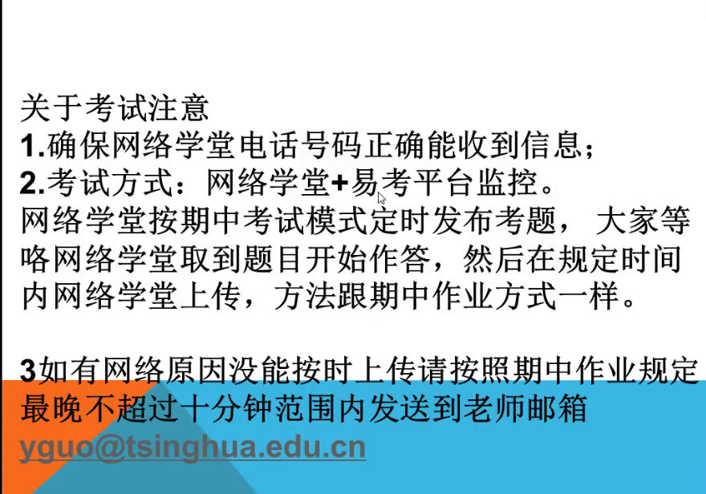
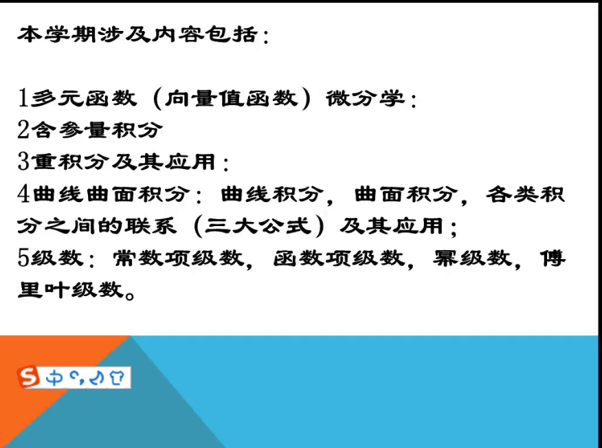

# 微积分复习
- # 考试流程
  - 
  
- 
# - 多元积分
- ## 曲线积分
  - 基本计算方式
  - 是否与路径无关（可以求原函数）
  - 如果是闭曲线则考虑格林公式和是托克斯公式
- ## 曲面积分
  - 基本计算方法
  - ### 高斯公式
    - 包含奇点的处理
- # 级数
  - ## 常数项级数
  - ## 函数项级数
    - 求给定函数的泰勒公式
  - ## 幂级数
    - 如果想交换积分求和符号，需要验证是否一致收敛
    - 
  - ## 傅里叶级数
    - 求给定函数的傅里叶展开
    - 利用pasevald等式求系数组成项的级数的和
    - 