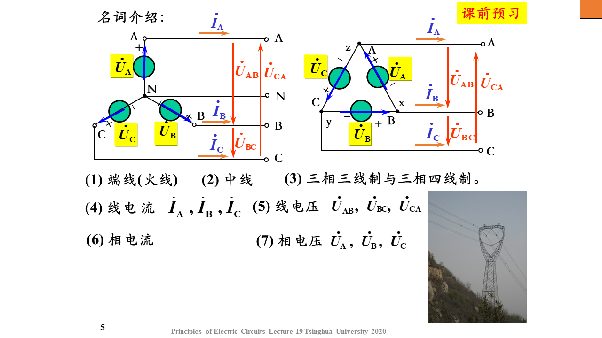
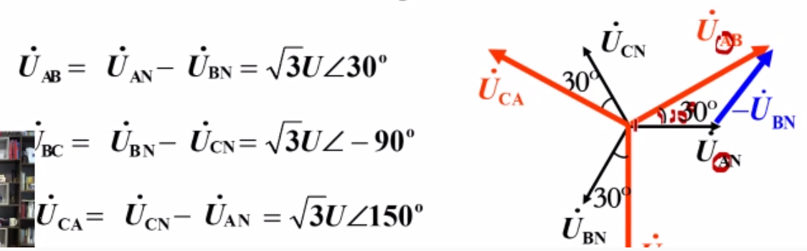
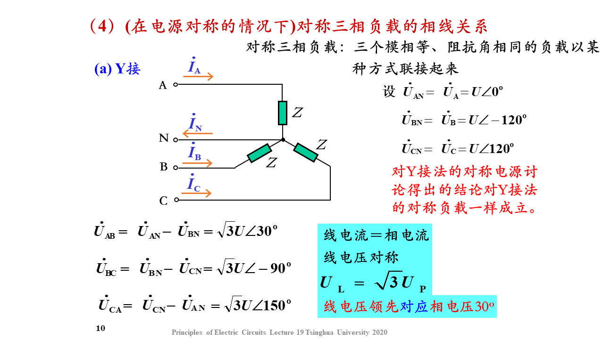
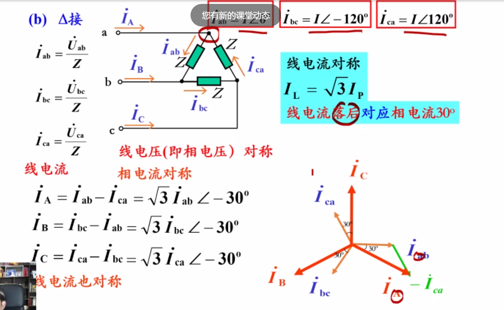
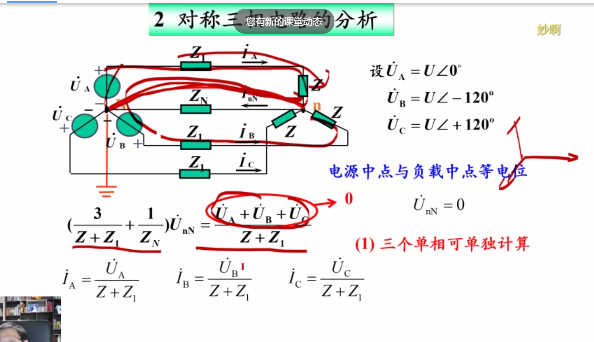
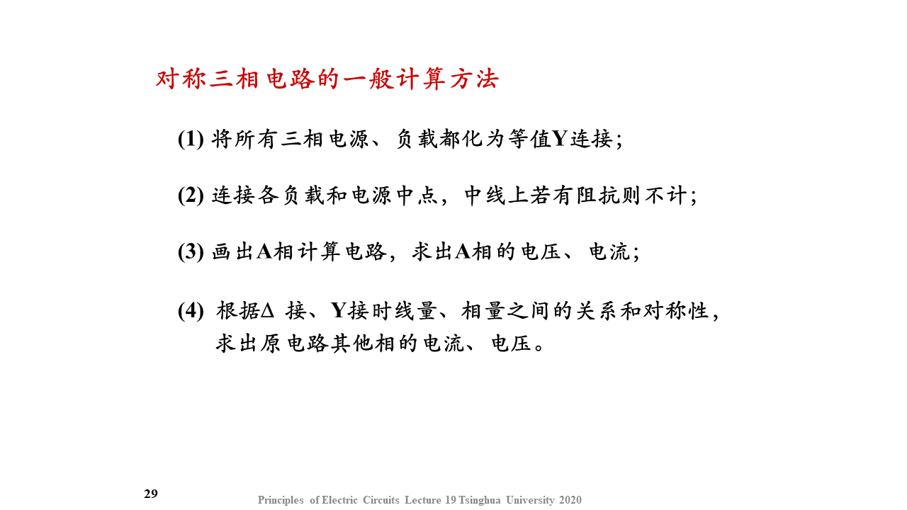
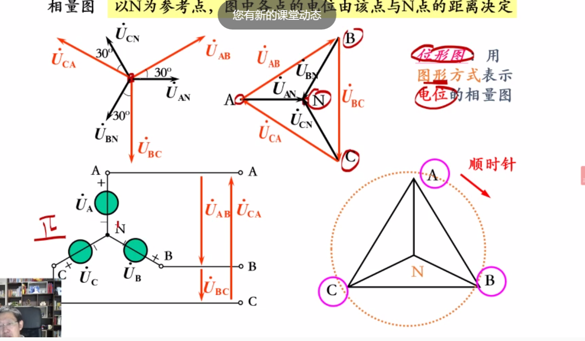
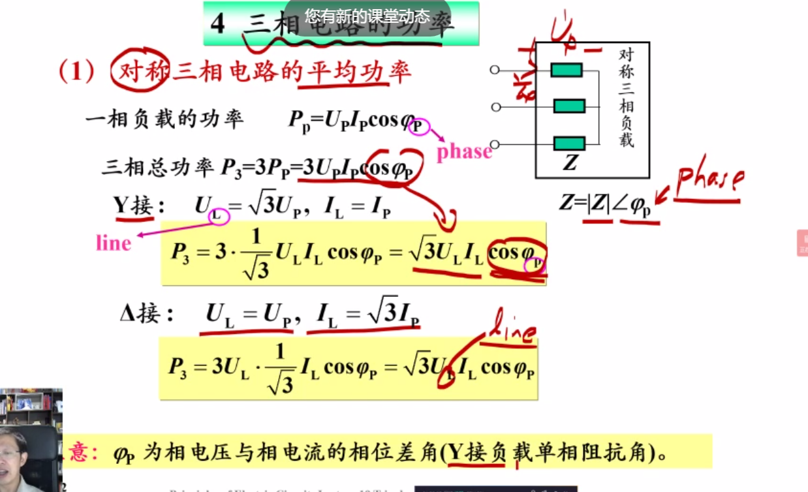
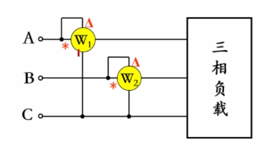

# 三相电源
-   ##  基本概念
    -   定义： 三个复制频率相等，相位相差120度的电源
    -   
-   ## 对称三相电源的相线关系
    -   ### Y接
        -   
        -   **可根据相量图快速判断**
    -   ### $\Delta$接
        -   相=线电压
-   ## 对称负载
    -      
    -   
-   ## 对称三项电路分析
    -   
    -   由对称性，可以只抽一项（A相）
-   ## 总结：计算方法
-   
-   # 不对称三相电路
    -   位形图
    -   
    -  向量图中UAB = B->A
    -  位形图是A->B
 -  # 三相电路的功率
 -  
    -  ## 功率测量
       -  有N 三表法
       -  无N
          -  
          - $W =  P_1 +P_2$
          - 
        - ## **二表法不能用于不对称的三相四线制，但是对称的可以**
      - 二表法的接线方式有3种（共A|B|C）
           

