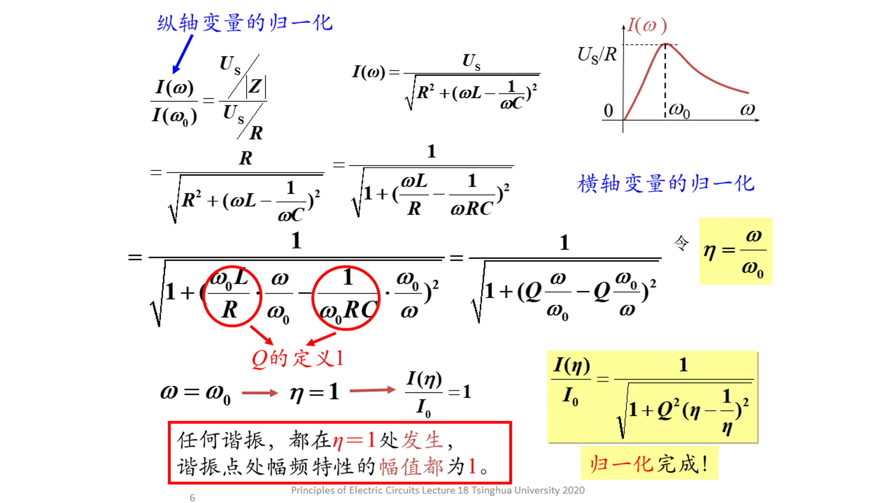
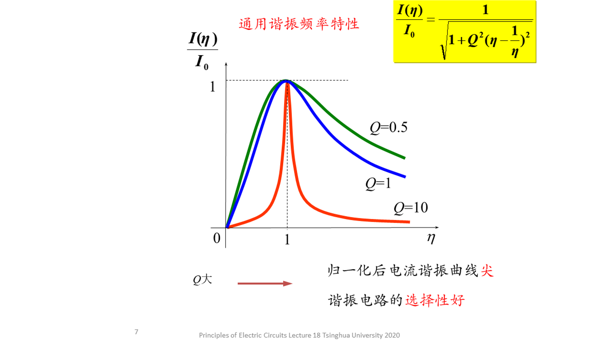
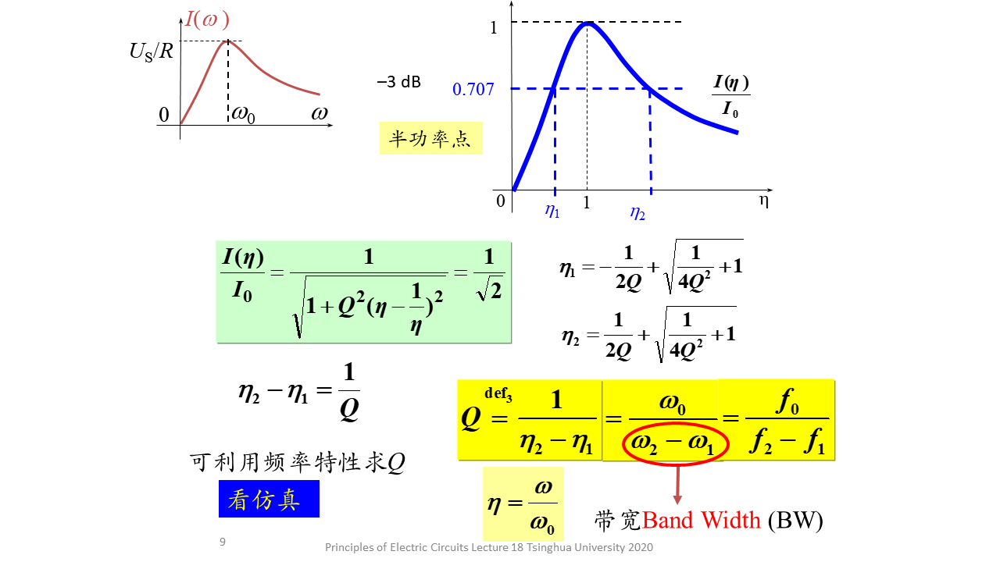
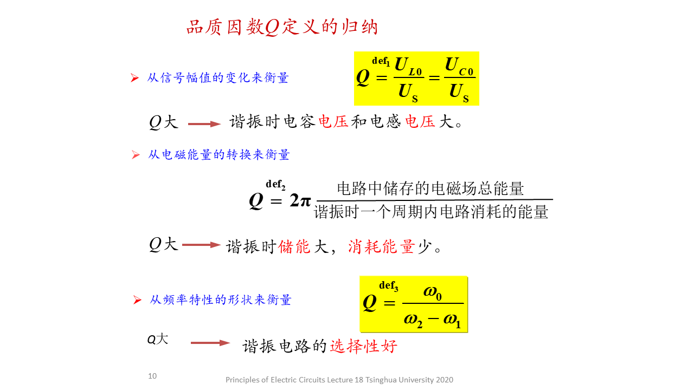
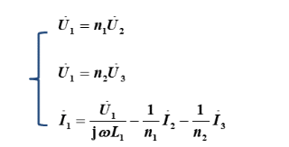
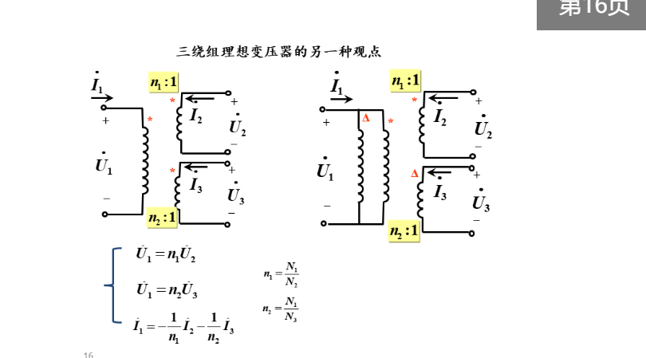

# 第不知道多少次习题课
- # 频率特性和滤波器
  - |Z| $\phi$ U I |H|等
  - |H|: Uout/Us = 0.707 时 **半功率频率**
- # 谐振
  - ## 品质因数
    - ### 储能元件内的电压放大倍数
    - ### 通过能量
    - ### 通过传递函数的频率特性
      - RLC串 电流幅频特性的归一化
      - 
      - 
      -  Q越大，在极大值点以外电流值越小，滤波能力越强
      -  
      -  
   -  # 三绕组变压器
      -  ## 全耦合
         -   
         -   n1=N1/N2 n2=N1/N3
       -  ## 理想三端变压器
          -  iN1 =-(iN2+iN3)能量守恒
          -  可看做并联
          -  