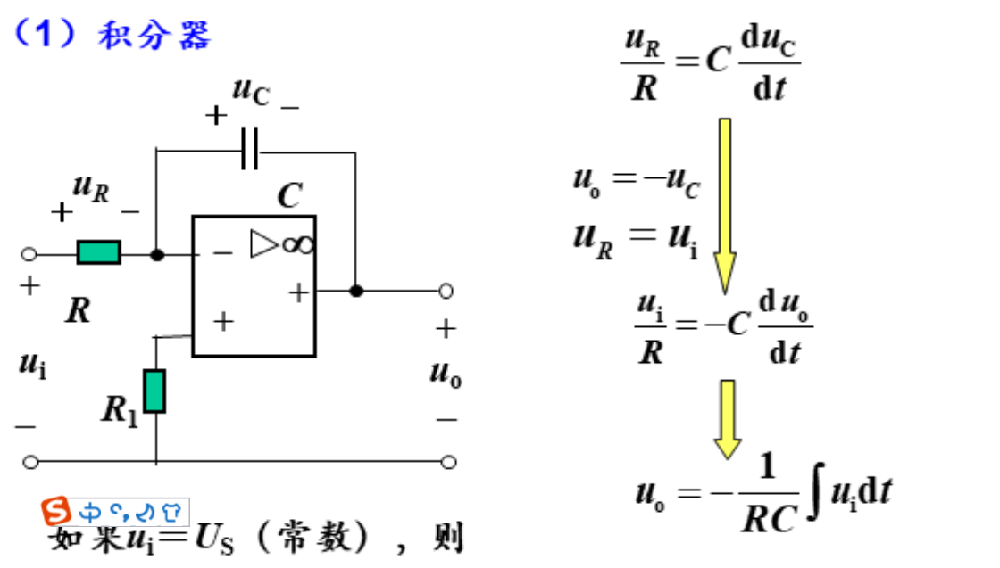

# 电路原理期末复习
  期中考试之后的部分

# 动态电路
- # 恒定激励 
  - ## 储备知识
    - ## 一阶动态电路的求解
      - 定义:由恒定激励源和唯一的电容或电感以及电阻组成的电路
      - ## 电容 
        - $i(t)=C\frac{du}{dt}$
        - $u(t) = u_0+\int_0^tid\tau$
        - 能量$W= \int_0^tuidt=\int_0^uCudu=1/2Cu^2$
        - 电荷守恒：电流的积分是电荷，表示溜进去多少电荷，C代表存储电荷的能力，即每伏能存多少电荷，于是除以C得到电压
      - ## 电感
        - 对偶
        -  $u(t)=L\frac{di}{dt}$
        - $i(t) = u_0+\int_0^tud\tau$
        - 理解：磁链守恒。电流会在周围产生磁场，这个磁场通过一圈一圈的线圈交叉形成磁链。冲电压相当于冲磁，会反映到电流上。
      - ## 电容电感的串并联
        - 研究端口的ui 关系即可。可以用微积分石子研究，也可以用能量研究
        - 电感的串并联规律相当于电阻，而电容与之对偶
    - # 常系数微分方程的求解
      - 列写微分方程，求特征根，求特解（由于此方程可以描述电路任意时刻的情况，因此无穷时间后稳定的情况是一个很好的特解），根据起始状态确定通解系数。
      - ## 公式：
      - ## 对该公式的理解
        - ## 三要素法
        - ### 求解初值和稳态值和时间常数
          - ### 一阶电路的时间常数 $\tau=RC||L/R$
          -  ### 求解初值：换路定理
              -  电路在换路时刻电容电压和电感电流一般守恒，特殊情况下有冲击电流，应用电荷守恒
              -  用电压源电流源来替换电路中的电容和电感求解其他之路
        -  ## 零输入和零状态，线性叠加
   -  # 脉冲序列作用下的RC 电路
      -  ## T>>$\tau$（3到5个）
         -  可以达到稳态
         -  
      -  ## 两者接近求解稳态
         -  认为达到稳态
         -  画不同状态的电路图，求电路解
         -  根据关键的边界条件求出关键参数
         -  
   -  # 应用:
      -  ## 直流交流变换
         - ### 1. 通过桥式整流将负部分翻上来
            -  
         - ### 通过电容来磨平波形
           - 
       - ## DC-DC变换
         - ### 利用开关电路
           - 
           - 缺点：直流质量差
         - ### 升级方式：通过电感+续流二极管维持电流
         - 
         - 利用微分方程算出i,认为i不变，u不变，在工程观点中利用能量守恒计算
         - 
         - 
         - ## **降压斩波器**
         - ## **升压斩波器**
         - 
         - ton时间电感获得充电，电容被拦住，自己玩
         - toff时刻电感给电容充电
         - 稳态时电感充放电能量守恒，toff时刻电容起到充电作用，Uc比Us高。
         - （UC=t/toffU
         - # 微分器和积分器
         - 
           - 通过运放锁定R右侧的零电压，为电容供给U/R的恒定电流，来实现积分功能（方波=》三角波）
           - 
           - 通过运放锁定C右端零电压，为R供给C(duin/dt)的电流
           - 总结：运放的作用是锁定电压而提供电流。给电容供给电流则是积分，改变电容电压产生电流则是微分
         - # 滞回比较器
           - 
           - 扰动=》U0达到max通过分压反馈给正向输入端，放大差异。大道至会比较的目的（不会描述了）
           - # 利用滞回比较器实现方波发生器
           - 以电容串电阻连接滞回比较器的输出端，把电容分压作为反向输入
           - 发生轻微扰动使得Uo直接标满，同时开始给电容反向充电，一段时间后达到滞回临界，Uo反向标满，从而继续反向充电，如此循环。
           - 通过边界条件解得
           - 
         - ## MOSFET寄生电容传播延迟
           - 一般只考虑Cgs
           - 反相器电路
           - 
           - 由于寄生电容和RL串联的充电电路，Ug的电压无法瞬时跟随
           - 1号导通时与寄生电容连接的电阻是小电阻与RL并联，较小（约Ron），周期较短，影响较小，可以快速降到(分压，约0)
           - 1号关段的充电电路电阻大（Rl），充电慢 