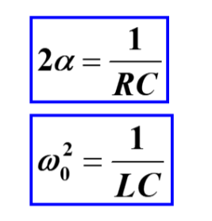
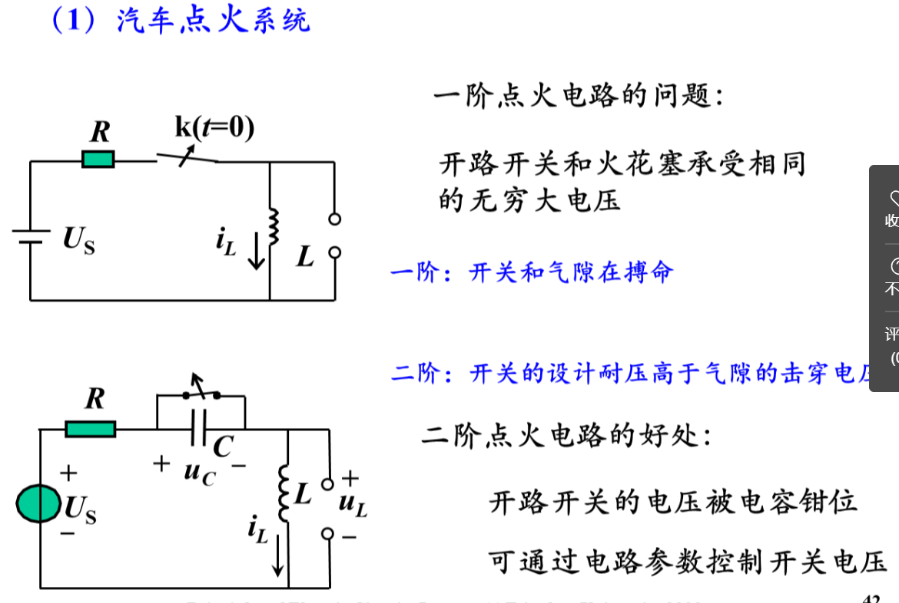
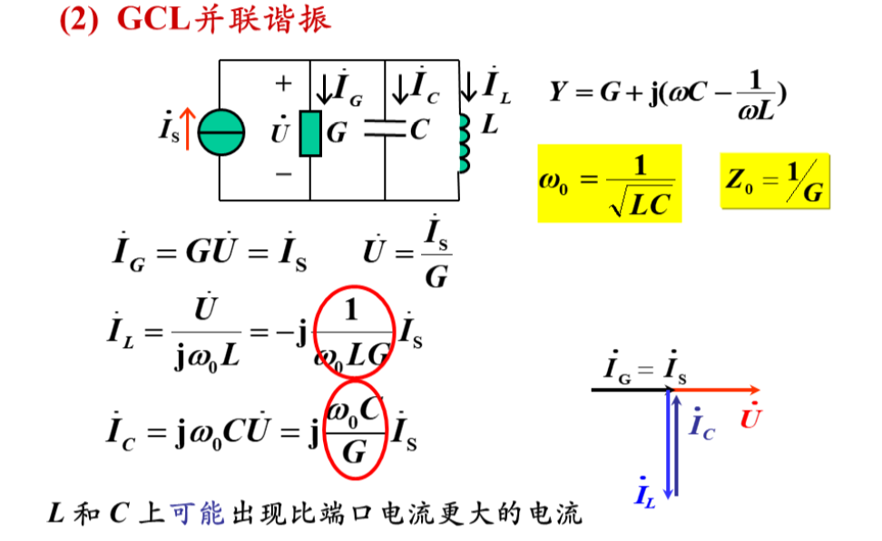
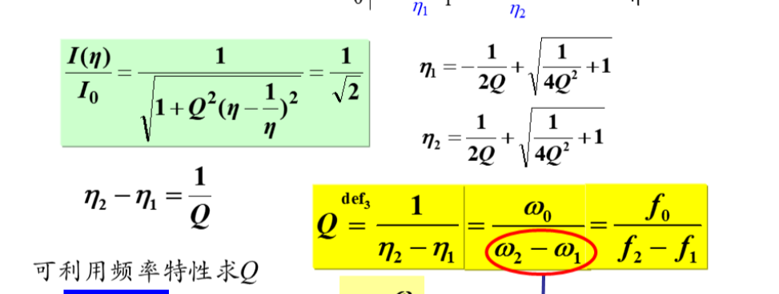

# 电路原理期末复习
  期中考试之后的部分

# 动态电路
- # 恒定激励 
  - ## 储备知识
    - ## 一阶动态电路的求解
      - 定义:由恒定激励源和唯一的电容或电感以及电阻组成的电路
      - ## 电容 
        - $i(t)=C\frac{du}{dt}$
        - $u(t) = u_0+\int_0^tid\tau$
        - 能量$W= \int_0^tuidt=\int_0^uCudu=1/2Cu^2$
        - 电荷守恒：电流的积分是电荷，表示溜进去多少电荷，C代表存储电荷的能力，即每伏能存多少电荷，于是除以C得到电压
      - ## 电感
        - 对偶
        -  $u(t)=L\frac{di}{dt}$
        - $i(t) = u_0+\int_0^tud\tau$
        - 理解：磁链守恒。电流会在周围产生磁场，这个磁场通过一圈一圈的线圈交叉形成磁链。冲电压相当于冲磁，会反映到电流上。
      - ## 电容电感的串并联
        - 研究端口的ui 关系即可。可以用微积分石子研究，也可以用能量研究
        - 电感的串并联规律相当于电阻，而电容与之对偶
    - # 常系数微分方程的求解
      - 列写微分方程，求特征根，求特解（由于此方程可以描述电路任意时刻的情况，因此无穷时间后稳定的情况是一个很好的特解），根据起始状态确定通解系数。
      - ## 公式：
      - ## 对该公式的理解
        - ## 三要素法
        - ### 求解初值和稳态值和时间常数
          - ### 一阶电路的时间常数 $\tau=RC||L/R$
          -  ### 求解初值：换路定理
              -  电路在换路时刻电容电压和电感电流一般守恒，特殊情况下有冲击电流，应用电荷守恒
              -  用电压源电流源来替换电路中的电容和电感求解其他之路
        -  ## 零输入和零状态，线性叠加
   -  # 脉冲序列作用下的RC 电路
      -  ## T>>$\tau$（3到5个）
         -  可以达到稳态
         -  
      -  ## 两者接近求解稳态
         -  认为达到稳态
         -  画不同状态的电路图，求电路解
         -  根据关键的边界条件求出关键参数
         -  
   -  # 应用:
      -  ## 直流交流变换
         - ### 1. 通过桥式整流将负部分翻上来
            -  
         - ### 通过电容来磨平波形
           - 
       - ## DC-DC变换
         - ### 利用开关电路
           - 
           - 缺点：直流质量差
         - ### 升级方式：通过电感+续流二极管维持电流
         - 
         - 利用微分方程算出i,认为i不变，u不变，在工程观点中利用能量守恒计算
         - 
         - 
         - ## **降压斩波器**
         - ## **升压斩波器**
         - 
         - ton时间电感获得充电，电容被拦住，自己玩
         - toff时刻电感给电容充电
         - 稳态时电感充放电能量守恒，toff时刻电容起到充电作用，Uc比Us高。
         - （UC=t/toffU
         - # 微分器和积分器
         - 
           - 通过运放锁定R右侧的零电压，为电容供给U/R的恒定电流，来实现积分功能（方波=》三角波）
           - 
           - 通过运放锁定C右端零电压，为R供给C(duin/dt)的电流
           - 总结：运放的作用是锁定电压而提供电流。给电容供给电流则是积分，改变电容电压产生电流则是微分
         - # 滞回比较器
           - 
           - 扰动=》U0达到max通过分压反馈给正向输入端，放大差异。大道至会比较的目的（不会描述了）
           - # 利用滞回比较器实现方波发生器
           - 以电容串电阻连接滞回比较器的输出端，把电容分压作为反向输入
           - 发生轻微扰动使得Uo直接标满，同时开始给电容反向充电，一段时间后达到滞回临界，Uo反向标满，从而继续反向充电，如此循环。
           - 通过边界条件解得
           - 
         - ## MOSFET寄生电容传播延迟
           - 一般只考虑Cgs
           - 反相器电路
           - 
           - 由于寄生电容和RL串联的充电电路，Ug的电压无法瞬时跟随
           - 1号导通时与寄生电容连接的电阻是小电阻与RL并联，较小（约Ron），周期较短，影响较小，可以快速降到(分压，约0)
           - 1号关段的充电电路电阻大（Rl），充电慢 
- # 二阶动态电路
  - ## RLC串联二阶电路
  - ## 特征方程
    - 1.以Uc为基础，根据KVL列方程
    - 2.或以i为基础，KVL列方程=》特征方程瓦全相同
    - 公式：
    - 
    - ### 拆分成零状态+零输入，电路的特征方程相同
    - ## 二阶电路的不同情况
      - 
      - $\alpha 衰减系数 \omega_0自由震荡角频率$
      - ### 对于欠阻尼和无阻尼的解释：
        - 所解出的p是e的指数，用e指数乘法法则拆成实指数和虚指数两部分相乘。e的虚指数利用欧拉公式转变成三角函数，于是特征根等价变形为a,b， 将（a+b）和-j(a-b)做线性组合即可得到所得解。A和θ两个参数即可代表任何二阶微分方程的其次通解。
    - ## 求解初值
      - 需要两个初始条件即U0和U'0来确定两个参数。
      - 通过ic= Cdu/dt等可以把导数初值转换为电路状态值
  - ## RLC 并联二阶电路
    - 对偶
    - 
    - 
  - ## 二阶电路的直觉解法
    - ### 不求待定系数画之路量的拜年话曲线
      - 判断阻尼情况
      - ### 如果是过阻尼或者临界阻尼，根据初值和导数初值以及最终值
        - 形如$Ae^{-k_1x}+Be^{-k_2x}$的导数最多只有一个零点，原函数曲线最多一个拐
      - ### 欠阻尼
        - 根据初值终止导数初值和$\alpha 与 w_d的对比关系判断需要多少个周期衰减完成$
        - 
      - ### 无阻尼
        - 
        - 根据能量关系求出最大值
    - 
    - ## 二阶电路的应用
      - 
      -  合上电源给电感充能
      -  断开开关后电感给电容充能，较为可控地提升电容电压，直到把火花塞击穿。避免瞬间给个超大电压
      -  ### 电磁轨道炮
 -  ## 用状态方程求二阶电路
    -  ## 知识储备
       - ### 状态变量：唯一确定电路今后任何时刻状态的一组t0时刻状态量
       - ### 状态方程： 用状态变量和激励的线性组合来表示状**态变量的微分**
       - 
       - 
       - 根据换路定理Uc iL都是是可以求出并看做电源的东西，求它们的导数都可以转换为对应的之路量，这保证了状态方程的可列性。从而根据这个二阶微分方程组可以解出二阶电路的状态函数。
       - 把lc看做电源用节点法可以求出节点电压，用节点电压表示所求量即可
       - ### 输出方程：用状态变量和激励表示输出变量的代数方程
       - ### 利用状态方程求解状态函数
         - 激励部分是常数项，是非齐次部分，可以直接扔掉、
         - 特征根用矩阵算法来求
       - ### 求任意之路量的导数初值
         - 用状态量和激励表示输出量
         - 对两边求导
         - 利用状态方程求出导数初值
           - （状态方程描述了任意时刻的电路状态，当然也包括零时刻）
       - ## 流程
         - 1.列状态方程
           - 根据节点法把LC看做电源接触节点电压
           - 根据节点电压表示Cdu/dt,Ldit/dt,得到状态方程
         - 2.列输出方程
           - 根据节点电压表示输出量
         - 3.求特征根以及特征函数
         - $|\lambda I-A|=0$
         - 4.求状态量初值
           - 根据环路定理
         - 5.求状态量导数初值
           - 把状态量初值代入状态方程
         - 求所求量的初值和导数初值
           - 所求的状态量和导数初值代入输出方程
         - 根据这些采用待定系数法算出解
  - # 阶跃、冲激、卷积
    - ## 知识储备
      - ## 单位阶跃函数
        - 
        - 延迟单位阶跃
        - 
        - 单位阶跃函数的组合可以构成复杂信号
        - 
      - ## 单位阶跃响应
        - 
      - ## 通过拆分成ZSR和ZIR，单位阶跃响应可以叠加
      - ## 单位冲激函数
        - 
        - 可以看做单位阶跃函数求导
        - $\delta 函数的筛分性$
          - 
      - ## 单位冲激响应
        - 单位冲激函数在电路中引起的零状态响应
          - 0以后是ZIR（自然衰减）
          - 关键是0 的瞬间
        - 1.替代定理：把电容看做有限值电压源（因为能量不能突变）
        - 2.单位阶跃函数求导法
          - 单位冲激函数的响应可以看做是单位阶跃函数的求导
          - 单位冲激函数=两个单位阶跃函数之差
          - 单位冲激函数的响应= 两个单位阶跃函数的响应之差，正好是求导形式
        - ## 卷积积分
        - 求任意激励的响应
        - 通过叠加
        - 首先将f(x)拆分成无数段阶跃函数
        - 则响应等于这些阶跃函数的和
        - 
        - 
        - t0时刻的函数在t时刻的贡献是f(t0)h(t-t0)（t0时刻的冲激）
        - 卷积积分的性质：f1(t)*f2(t) =f2(t)*f1(t),写成和式即可证明
        - 满足分配率，交换律，结合律
        - f(t)*$\delta (t)$=f(t)
        - ## 图解法
          - 卷积本质上是g(x)=f1(x)f2(-x+t）在0-t的积分。
          - 画图像表示来看这个函数的值，y对称后往右平移即可
          - 
- # 正弦稳态
  - 相量
  - **(不要忘记$\sqrt{2}$关系)**
    - C： i = $C\frac{du}{dt}$如果u是一个正弦值Asin(wt+θ），则i =wCcos(wt+theta)
    - L同理
    - 如果我们用虚数来表示这些三角函数，并且忽略其cos部分，即
    - 设U = Asin(Wt+θ)，i=Bsin(wt+θ)
    - 则$i=C\frac{du}{dt}$
    - 即$Im（i+对应实部）=C(U+d对应实部)'的虚部$
    - 如果Im满足此条件，则Re自动满足此条件，即两者等价。
    - 即 i. =jwC u.
    - 即对于这个电路，如果把各之路量作为虚部，对应部分作为实部组成向量，处处满足这个条件。
    - 因此引入阻抗的概念了。通过线性方程可以求解任何一点的之路量
    - 阻抗：$X_Lj=jwL X_Cj=-j\frac{1}{wC}$(l电压领先电流C电流领先电压90度)
    - 导纳：B= 1/X
    - 向量图 一张图上画出若干向量，选取参考方向是关键
    - 电压电流向量写成模和相角，阻抗写成复数
  - ## 正弦激励下的过度过程
    - 状态方程不变，所以形式不变
    - f(t)= 稳态表达式+(零状态-稳态初始值)E-1/tct
  - ## 正弦稳态的功率
    - ### 瞬时功率
      - $p_吸=ui$W,Pr非负震荡，$P_L和P_C正负震荡$
      - 瞬时功率的角频率2w
      - 
    - ### 平均功率
      - W
      - R=》$P=UI\cos\phi=UI=I^2R$
      - C\L =>P=0
      - 平均功率就是电路消耗在电阻上的功率（有功功率）
      - $\varphi=\psi_u-\psi_i$ 功率因数角 
      - cosphi 功率因数
      - 滞后指的是电流滞后电压(感性，phi>0)
      - 
    - ### 功率因数的提高
      - 
      - 在用户短并联电容器
      - 
      - 
    - ### 有功功率的测量
      - 功率表是个傻东西，啥也不会
    - ### 无功功率
      - 
      - 
      - 无功功率反应器的能量变化的最大速率
    - ### 无功功率与电压的关系
      - 
      - 
    - ### 复工率
      - 
    - ### 视在功率
      - 
      - 
  - # 互感
    - ## 解释
      - 电压的产生是磁通和线圈铰链形成磁链，磁链的变化催生电压。
      - 而这些磁通来源于每一匝线圈里的电流。来自本线圈或者别的线圈跑过来。
    - ## 同名端
      - 两个电感，流过这两个电感的电流会影响两个电感的磁通，影响方向相同的端是同名端。互感的正方向是同名端的方向
    - ## 耦合系数
      - 描绘耦合的程度，即漏磁通的量
      - n匝线圈，每一匝上的电流造就一个磁通，又穿过n匝线圈，所以电感理想情况下为kn^2.
      - 互感则为kn1n2
      - 因此$M_max=\sqrt{L_1L_2}$
      - ### 耦合系数$k=\frac{M}{L_1L_2}\leq 1$
    - ## 去耦等效
      - ### 串联
        - 同名端顺串：$L_eq=L_1+L_2+2M$
        - 反串：Meq=-M
      - ### 并联
        - 顺并：排斥出来一个M
        - 
      - ### 公共节点
        - 类似于并联
        - 
        - 
        - 
  - # 谐振
    - ## 不要忘记$f=\frac{\omega}{2\pi}$
    -  定义
       -  电流和电压出现同相位
       -  物理本质：电感电容互相传输，自己玩着。于是可把外电路短路来看
    -  ## RLC串联谐振
       -  L C产生抵消的电压（可能高于端口电压） 带呀写着
       -  
    -  ## RLC并联谐振
       -  
    -  ## 应用：视为滤波器
       -  在$\omega=\frac{1}{ \sqrt{LC}}$时候阻抗最小，可以把这部分电流导走
    -  ## 图像
       -  
       -  
    -  ## 混联谐振
       -  串联+并联可同时发生两种谐振
       -  
    -  ## 品质因数
       -  
       -  与w无关
       -  特性阻抗
    -  ## 能量角度理解：
       -  有功无功解耦
    -  ## 能量角度定义的品质因数
       -  
    -  
   -  ## 归一化通过电流扶贫曲线来观察
   -  
   -  
   -  ## 通过半功率点来求品质因数
      -  结算方程可得
      -  

