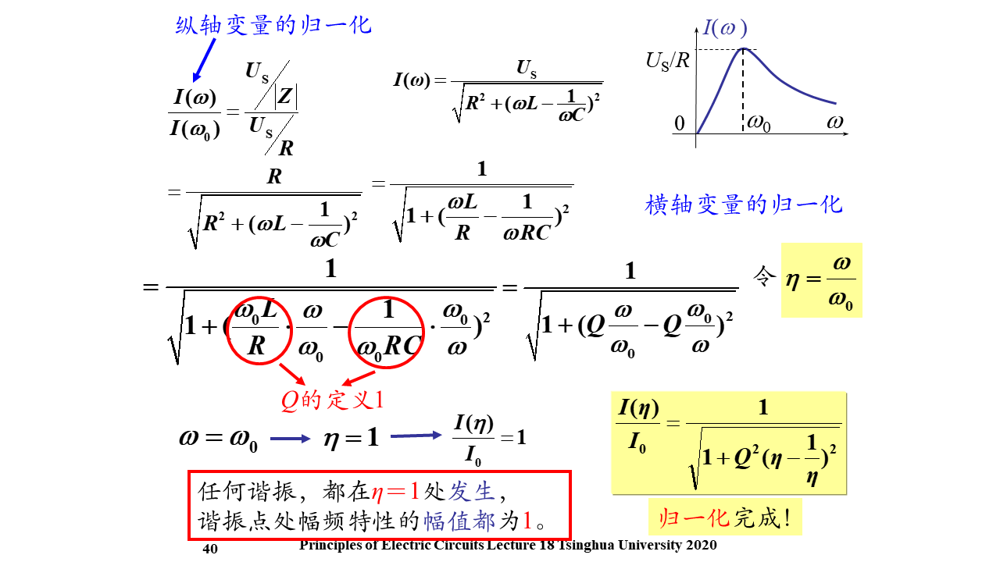

# 谐振
- ## **注意频率和角频率！**
- # 定义
  -  ## 端口电压电流相位相同
  -  ## 在品质参数极高时和物理上的谐振是等价的
-  # RLC串联谐振
   -  ## 电压谐振
      -  
      -  ### 支路电流 =U/R LC分电压 =LC阻抗*电流
      -  ### 分电压可以超过电源带你呀
-  # RLC并联谐振
   -  ## 电流谐振
   -  
     -  ## 支路电压= I/G LC分支电流 =U/Xc 
     -  ## 分电流可以超过电源电流
-  # 谐振可以视为滤波器：串联视为带阻滤波器，并联视为带通滤波器
-  # LC串联谐振
  -  
  -  
-  # 混联谐振
   - ##  混连后X=0为串联谐振，1/X=0为并联谐振
   - ## ex.
   - 
   - 对于该电路（电容串（容感并））
   - 幅频特性先到零点再到无穷点，对低频短路对高频开率
   - 可以利用起绿波
 - # 谐振电路的质量因数
 - # 电压角度
   - 
 - # 能量角度
   - 
   - 电源不给LC提供功率而只提供给电阻
   - $Q=2\pi \frac{电路中储存的电磁场总能量}{谐振一个周期电路消耗的能量}$
 - # 非理想电容的损耗角
   - 
 - # 根据电流的幅频特性比较两点路的Q
   - 
   - 
